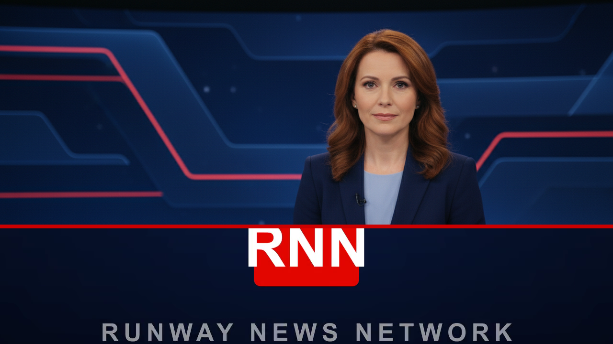

<p align="center">
  
</p>

# Runway News Network (RNN)

**Paste a news link. Get a 30-second AI-anchored broadcast.**

RNN turns any news article into a short broadcast-style news segment: it reads the
story, writes the script, generates an AI anchor and B-roll footage, adds chyrons
and a branded opener, and stitches it all into a single MP4 — automatically.

It's a single Next.js app: the web UI, the JSON API, and the media-generation
pipeline all run in one Node process.

---

## How it works

Each request runs through a multi-stage pipeline (`lib/pipeline.ts`):

1. **Extract** (`lib/extract.ts`) — Fetch and clean the article. Robust against
   paywalls and JS-heavy pages via a fallback chain: direct fetch + Readability
   → JSON-LD `articleBody` → [Jina Reader](https://jina.ai/reader) → Wayback
   Machine → optional ScraperAPI. Bot-walls and error pages are detected and
   skipped, and failures are classified (paywall / not-found / unreadable / …)
   for clear UI messaging.
2. **Script** (`lib/fit.ts` → `lib/llm.ts`, `lib/tts.ts`) — An LLM deconstructs
   the story into a storyboard (headline, summary, and 2–6 scenes with
   narration + chyron text), fitted to a target runtime.
3. **Generate** (`lib/runway.ts`) — Per scene, in parallel:
   - a photorealistic keyframe (text-to-image),
   - **anchor scenes**: a lip-synced talking-head driven by the narration audio
     (final tier) or the branded anchor still (draft tier),
   - **B-roll scenes**: image-to-video animation (final) or a held still (draft),
   - narration voiced via text-to-speech.
4. **Stitch** (`lib/compose.ts`) — `ffmpeg` assembles the opener + scenes with
   chyron and logo overlays into the final broadcast.

Progress streams to the UI as the job moves through
`extracting → scripting → generating → stitching → completed`.

### Quality tiers

| Tier      | Script model | Frames             | Motion           | Anchor                   | Cost  |
| --------- | ------------ | ------------------ | ---------------- | ------------------------ | ----- |
| **draft** | small/fast   | fast image model   | held still frame | branded still            | cheap |
| **final** | large model  | high-quality image | image-to-video   | lip-synced custom avatar | full  |

Models are centralized in `lib/models.ts` — swap IDs there, not in stage code.

---

## Features

- **Bare paste-a-link UI** with live, broadcast-styled progress orchestration.
- **Watch** — a full-screen viewer to browse finished broadcasts (←/→ + auto-advance).
- **Persistence** — every request's inputs, generated components, logs, and final
  video are mirrored to Supabase (best-effort; the app runs fine without it).
- **Custom anchor avatar** — the final tier builds a reusable lip-sync avatar from
  your own anchor image (`brand/anchor.png`).
- **Access gate** — final-tier generation can be locked behind a server-side
  password (never exposed to the frontend).
- **Final-only mode** — an env flag to disable draft generation/viewing in prod.

---

## Tech stack

- **Next.js (App Router) + React + TypeScript + Tailwind CSS v4**
- **ffmpeg** for compositing (must be installed natively)
- **Generative APIs** for script, image, video, lip-sync, and TTS
- **Supabase** (Postgres + Storage) for optional persistence

---

## Getting started

### Prerequisites

- **Node.js 20+**
- **ffmpeg** on your `PATH` (`brew install ffmpeg`, `apt install ffmpeg`, …)
- API keys for your generative providers (see `.env.example`)
- *(optional)* a Supabase project for persistence

### Setup

```bash
git clone <your-fork-url>
cd runway-news-network
npm install
cp .env.example .env   # then fill in your keys
npm run dev
```

Open http://localhost:3000, paste a news URL, and generate.

> Without API keys the pipeline can't produce media. With Supabase unconfigured,
> generation still works — persistence and the Watch/archive views are just empty.

### Environment variables

See [`.env.example`](./.env.example) for the full list. Highlights:

| Variable                                                        | Purpose                                              |
| -------------------------------------------------------------- | --------------------------------------------------- |
| `ANTHROPIC_API_KEY`                                            | LLM for article deconstruction + storyboard         |
| `RUNWAY_API_KEY`                                              | Image, image-to-video, lip-sync, and TTS generation |
| `ELEVENLABS_API_KEY`, `TTS_VOICE_ID`                          | Optional direct TTS voice                            |
| `SUPABASE_URL`, `SUPABASE_SERVICE_ROLE_KEY`, `SUPABASE_ANON_KEY` | Optional persistence + video storage             |
| `QUALITY_TIER`                                                | Default tier (`draft` or `final`)                   |
| `RNN_FINAL_PASSWORD`                                          | If set, final-tier generation requires this password |
| `NEXT_PUBLIC_RNN_FINAL_ONLY`                                  | `true` to force final-only mode (hides/blocks draft) |

### Persistence (optional)

Apply the schema in [`supabase/migrations/0001_init.sql`](./supabase/migrations/0001_init.sql)
to your Supabase project (SQL editor or CLI). It creates `jobs`, `scenes`, and
`job_logs` tables plus a public `segments` storage bucket.

### Custom anchor avatar (final tier)

Replace `brand/anchor.png` with your anchor portrait, then warm the lip-sync
avatar once so the first final render isn't slow:

```bash
npm run build:avatar
```

---

## Useful scripts

```bash
npm run dev                     # local dev server
npm run build                   # production build
npm run start                   # production server
npm run step:extract -- <url>   # run a single pipeline stage for debugging
npm run pipeline -- <url>       # run the whole pipeline headless
```

(See `package.json` for the full list of per-stage debug scripts.)

---

## Deployment

The pipeline shells out to `ffmpeg` and runs **long background jobs in-process**,
so it needs a persistent Node server — **not** a serverless platform. A
[`Dockerfile`](./Dockerfile) is included (installs `ffmpeg`, builds, runs
`next start`) and works on any container host (Railway, Fly, Render, a VPS, …).

Set the same environment variables on your host. `NEXT_PUBLIC_*` values are
inlined at build time — the Dockerfile accepts `NEXT_PUBLIC_RNN_FINAL_ONLY` as a
build arg.

---

## Project structure

```
app/            Next.js routes + UI (landing, segment, watch, API routes)
  api/          REST endpoints (jobs, auth)
  components/   shared chrome
lib/            pipeline + integrations (extract, llm, runway, compose, db, auth, …)
worker/         optional standalone worker entrypoint
scripts/        per-stage dev/debug runners
supabase/       database migrations
brand/          opener video + anchor image
```

---

## Notes & caveats

- This is a reference/educational project. Generative APIs cost money — the
  **final** tier in particular consumes real credits per render.
- The default in-memory job store is fine for a single server instance; jobs are
  mirrored to Supabase so finished segments survive restarts.
- Respect the terms of service of any site you extract from and any API you use.

## License

[MIT](./LICENSE)
